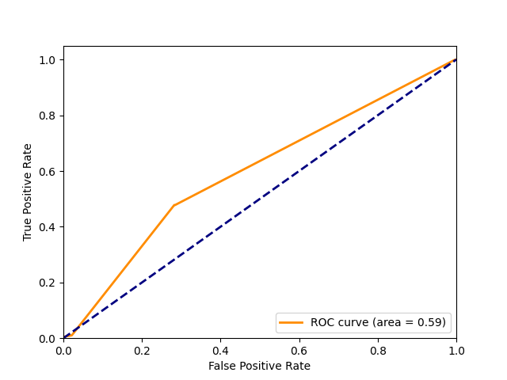

# AnomalyDetectionCVPR2018-Pytorch
Pytorch version of - https://github.com/WaqasSultani/AnomalyDetectionCVPR2018

## Future Improvements
In this section, I list the future improvements I intend to add to this repository. Please feel free to recommend new features. I also happily accept PR's! :smirk:

* I3D feature extraction

## Install anaconda env
```conda env create -f environment.yml```


```conda activate adCVPR18```

## Download C3D weights
I couldn't upload here the weights for the C3D model because the file is too big, but it can be found here:
https://github.com/DavideA/c3d-pytorch

## Precomputed features
Can be downloaded from:
https://drive.google.com/drive/folders/1rhOuAdUqyJU4hXIhToUnh5XVvYjQiN50?usp=sharing

## Pre-trained anomaly detector
Check out <a href="exps/models">exps/models</a> for for trained models on the pre-computed features

The loss graph during training is shown here:


<h4>SVG set Background Color</h4> 
  
        <svg height="100" width="100"> 
            <circle cx="50" cy="50" r="40" stroke="black" 
                    stroke-width="3" fill="red" /> 
        </svg> 

## Features extraction
```python feature_extractor.py --dataset_path "path-to-dataset"  --pretrained_3d "path-to-pretrained-c3d"```

## Training
```python TrainingAnomalyDetector_public.py --features_path "path-to-dataset" --annotation_path "path-to-train-annos" --annotation_path_test "path-to-test-annos"```

## Generate ROC curve
```python generate_ROC.py --features_path "path-to-dataset" --annotation_path "path-to-annos"```

Using my pre-trained model after 40K iterations, I achieve this following performance on the test-set. I'm aware that the current model doesn't achieve AUC of 0.75 as reported in the original paper. This can be caused by different weights of the C3D model.


## Demo *
```python video_demo.py --video_path_list LIST_OF_VIDEO_PATHS --model_dir PATH_TO_MODLE```

This should take any video and run the Anomaly Detection code (including CD3 feature extraction) and output a video with a graph of the Anomaly Detection prediction on the right-hand side (like in the demo code for the paper). It is all still a bit rough but it works and I do plan to add to it so I can always update later.

## Annotation *
```python annotation_methods.py --path_list LIST_OF_VIDEO_PATH --dir_list LIST_OF_LIST_WITH_PATH_AND_VIDEO_NAME --normal_or_not LIST_TRUE_FALUE```

This is currently just for demo but will allow training with nex videos

*Contrbuted by Peter Overbury of Sussex Universty IISP Group

## Cite
```
@misc{anomaly18cvpr-pytorch,
  author       = "Eitan Kosman",
  title        = "Pytorch implementation of Real-World Anomaly Detection in Surveillance Videos",
  howpublished = "\url{https://github.com/ekosman/AnomalyDetectionCVPR2018-Pytorch}",
  note         = "Accessed: 20xx-xx-xx"
}
```
